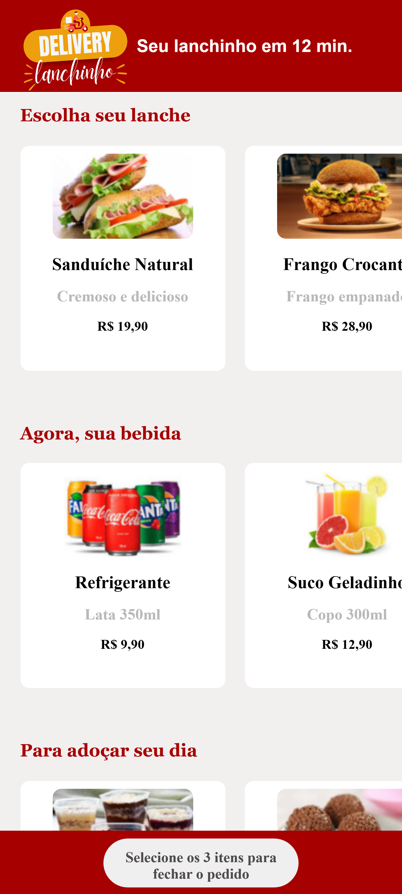

## Aplicativo Delivery Lanchinho em HTML / CSS / JAVASCRIPT:

Bem-vindo ao Delivery Lanchinho! 

Aplicativo para pedidos de lanches e direcionamento do pedido para whatsapp

Desenvolvimento web para visualização em smartphones.

## Layout desenvolvido com identidade visual própria 

* Cabeçalho com logo e slogan apresentando o delivery
* Listagem de todos os produtos;
* Rodapé com botão de finalização do pedido;

## Conheça o aplicativo clicando no link
https://polysaantana.github.io/LanchinhoDelivery/

  

### Ferramentas utilizadas: 

* Figma

* Canva

* Vscode

 

### Tecnologias:

* HTML

* CSS

* JAVASCRIPT

### Autora:
<table>
  <tbody>
    <tr>
	    <td align="center" valign="top">  <a href="https://github.com/polysaantana"> 
            
Polyanna
 </a>
      </td>
      </td>
    </tr>
  </tbody>
</table>
